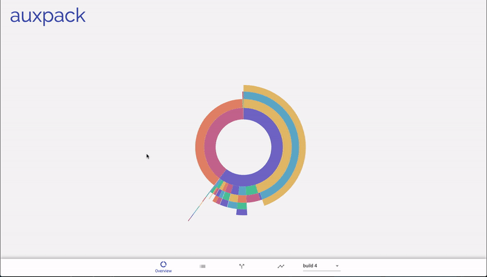

[中文](#中文翻译)

# auxpack
[](https://github.com/Auxpack/Auxpack/blob/master/LICENSE)
[](https://www.npmjs.com/package/auxpack)
[](https://github.com/Auxpack/Auxpack/issues)
[](https://github.com/Auxpack/Auxpack/network)
[](https://www.npmjs.com/package/auxpack)


auxpack is the new, (soon-to-be) configurable Webpack plugin that monitors statistics from your production builds. Our interactive interface allows developers to better understand bundle composition to get a better grasp on optimization strategies.



## Installation

Install via `npm i -D auxpack`

## Setup

```javascript
// webpack.config.js

const Auxpack = require('auxpack'); // import auxpack

modules.exports = [
// other configurations
  ... 
  plugins: [
    ...
    new Auxpack(  // add Auxpack into plugins
      {
        PORT: 1111, // configurable PORT
        targetFile: 'aux-stats', // configurable output filename
        logMe: true, // configure with true to console.log the current build's aux-stats
      }
    ),
  ]
  ...
]

```

## Usage

By installing the plugin into your Webpack configuration, you can run 
```webpack```
within your scripts as you would in production bundling, and our plugin will launch on port 1111. (We'll be adding a user port configuration option soon!)

Please note that collecting information on your first auxpack build may take a moment; this occurs due to our plugin collecting data.

## Contributing

To contribute to `auxpack`, please fork this repository, clone it to your machine, then install dependencies with ```npm install auxpack``` or ```yarn add auxpack```. If you're interested in joining the auxpack team as a contributor, feel free to message one of us directly!

## Authors

* Nobuhide Ajito (https://github.com/najito)
* Stephanie Chiu (https://github.com/stephkchiu)
* Travis Clark (https://github.com/tm-clark)
* Connie Lai (https://github.com/connielion)

# webpack-monitor

Many thanks to Webpack Monitor for passing the torch.
https://github.com/webpackmonitor/webpackmonitor

## License

This project is licensed under the MIT license - see the LICENSE.md file for details

# 中文翻译
auxpack是可配置的Webpack插件，用于监视生产版本中的统计信息。 我们的应用程序使开发人员可以更好地了解打包组成，从而更好地掌握优化策略。
## 安装方式
`npm i -D auxpack`
## 设定
在webpack.config.js里:
```javascript
// webpack.config.js
const Auxpack = require('auxpack'); // <--- 引入auxpack
modules.exports = [
// other configurations
  ... 
  plugins: [
    ...
    new Auxpack(  // 向 plugins 属性传入 new 实例
      {
        PORT: 1111, 
        targetFile: 'aux-stats', // configurable output filename
        logMe: true, // configure with true to console.log the current build's aux-stats
      }
    ),
  ]
  ...
]
```
## 用法
webpack运行后我们的插件会在1111端口里运行。
## 贡献
请fork这个资源库, 把仓库克隆在您的计算机上创建本地副本，然后用```npm install auxpack``` 或 ```yarn add auxpack```
下载依赖。如果您想加入我们的团队,请直接发讯息给我们。
